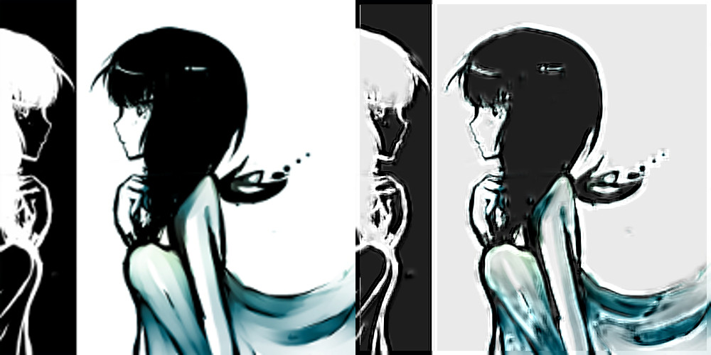

## Image super-resolution using deep convolutional neural networks 

## Overview

Super-resolution problem tries to upscale the image so that perceived loss of quality is minimal. For example after scaling with bicubic interpolation it is apparent that some pixels are just smudged together. The question is: *can AI do a better job ?*


## Preliminary results


*left: upscaling with bicubic interpolation, right: result of the presented algorithm*


*Details closeup - left: upscaling with bicubic interpolation, right: result of the presented algorithm*


As You can see presented method achieved significant improvement in the areas of: face boundaries, fingers, loose hair strands. On the other hand the finer details on the dress that require smooth gradient are lost. There are also numerous artifacts.

I believe that longer training time could fix some of the mentioned problems.


## Usage


#### General guidelines

* **application input is already scaled image that we are going to run through various filters**
* only luma channel is upscaled (so image presented above is quite close to edge case)
* best effects are achieved if image has lot of edges
* presented method does not handle textures particularly well
* it may be needed to optimize kernels for Your configuration to achieve faster learning process


#### Installation

You will need OpenCL capable hardware, modern GPU recommended. All required libraries are included in this repositorium ([libs](/libs)). It is recommended to link with the OpenCL library that can be found in Your PATH environment variable. You also should change paths in the [makefile](makefile) - they are result of my non-standard MinGW configuration.

This app was developed using clang & g++, they may be needed some changes to make it work in Visual Studio (like list_files() in [pch.cpp](src/pch.cpp) )

#### Command line

* **make build** - compile and create executable
* **make run -- CMD_ARGUMENTS_HERE** - run app with provided arguments (note double dash)
* **make test** - run all tests

#### Arguments:

`cnn [-h] [train] [dry] [profile] --config --in [--out] [--epochs]`

* **help** - print help
* **train** - train mode
* **dry** - do not store result
* **profile** - print kernel execution times
* **--config CONFIG** - configuration file
* **--in IN** - either image we want to upscale or samples directory during training
* **--out OUT** - output file path (either result image or new set of parameters)
* **--epochs EPOCHS** - number of epochs during training

#### Examples

Start the app: `bin\cnn.exe -c data\config.json -i data\my_image.jpg -o data\result.jpg`
  
Learning (500 epochs): `bin\cnn.exe train -c data\config.json --epochs 500 -i data\train_samples -o data\parameters.json`
  
Start the learning (100 epochs), do not save results: `bin\cnn.exe train -c data\config.json --epochs 100 -i data\train_samples dry`


#### Useful scripts:

* **[generate_training_samples.py](generate_training_samples.py)** - generate ready to use training samples based on images from provided directory 
* **[weights_visualize.py](weights_visualize.py)** - present weights as images. Layer 1 is particularly informative
* **[profile.py](profile.py)** - measure total execution time or time spend per OpenCL kernel
* **[schedule_training.py](schedule_training.py)** - executes C++ application, specify number of epochs or how long we want for learning to continue


#### Config file ([example](example_config.json))

Config file is just a simple JSON with following keys:
* *n1* - numbers of filters in first layer
* *n2* - numbers of filters in second layer
* *f1* - kernel spatial size in first layer
* *f2* - kernel spatial size in second layer
* *f3* - kernel spatial size in third layer
* *momentum* - momentum used during learning
* *weight_decay_parameter* - used to prevent overfitting
* *learning_rates* - learning rates used during training
* *parameters_file* - file that holds all parameters: weights and biases for layers (optional)

If You do not provide *parameters_file* the parameters will be initialized with random numbers from normal distribution (see example for details how this process can be customized).

#### Parameters file

Parameters are described with following simple structure:
```js
{
  "epochs": 0,
  "layer1": {
    "weights": [..],
    "bias": [..]
  },
  "layer2": {
    "weights": [..],
    "bias": [..]
  },
  "layer3": {
    "weights": [..],
    "bias": [..]
  }
}
```

Value for key *epochs* is optional and indicates how many epochs were finished during training process.


## References

SRCNN [1] was used as the main reference, but the idea was taken from waifu2x[2].

* [1] Chao Dong, Chen Change Loy, Kaiming He, Xiaoou Tang, "Image Super-Resolution Using Deep Convolutional Networks", http://arxiv.org/abs/1501.00092

* [2] waifu2x, https://github.com/nagadomi/waifu2x
 
If You are interested, I've also wrtitten 2 articles on the topic at hand:

* [Neural networks: implementation tips](https://scthe.github.io/2015/08/23/neural-networks-implementation-tips.html)

* [Backpropagation notes](https://scthe.github.io/2015/08/30/backpropagation-notes.html)

